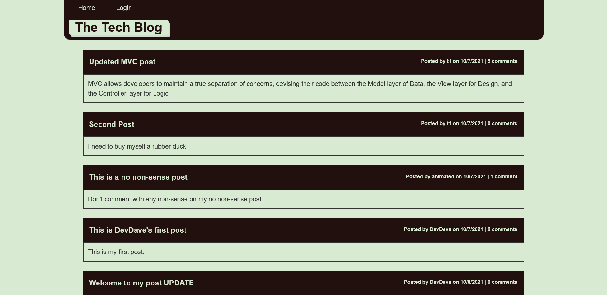

# Model-View-Controller | Tech Blog

## Description

Welcome to The Tech Blog. A CMS-style blog site where we as developers can create posts sharing our thoughts and opinions concerning Technologies. Here you can create an account and make your own posts. You can comment on other user's posts and they can comment on yours.

The Tech Blog exists because it's a full stack application that helps me hone my skills as a developer. It was built using MySQL, Node, HTML, CSS, Javascript, Handlebars, and other technologies.

## Table of Contents

- [Installation](#installation)
- [Usage](#usage)
- [Credits](#credits)
- [License](#license)
- [Author](#author)
- [Badges](#badges)

## Installation

This project does not require installation. Simply visit my [site](https://stark-reef-58838.herokuapp.com/)

## Usage

Simply visit my [site](https://stark-reef-58838.herokuapp.com/) and create an account. You can click on Dashboard if you wish to create your own posts. If you wish to comment click on the comments on the right of the posts. From there you can leave a comment. If you wish to edit your post go to your Dashboard. Under the post you wish to edit is the "Edit Post" link. Click on this link and you'll be taken to the Edit Post page.

## Credits

Credits

## License

MIT License

Copyright (c) [2021] [David Whipple]

Permission is hereby granted, free of charge, to any person obtaining a copy
of this software and associated documentation files (the "Software"), to deal
in the Software without restriction, including without limitation the rights
to use, copy, modify, merge, publish, distribute, sublicense, and/or sell
copies of the Software, and to permit persons to whom the Software is
furnished to do so, subject to the following conditions:

The above copyright notice and this permission notice shall be included in all
copies or substantial portions of the Software.

THE SOFTWARE IS PROVIDED "AS IS", WITHOUT WARRANTY OF ANY KIND, EXPRESS OR
IMPLIED, INCLUDING BUT NOT LIMITED TO THE WARRANTIES OF MERCHANTABILITY,
FITNESS FOR A PARTICULAR PURPOSE AND NONINFRINGEMENT. IN NO EVENT SHALL THE
AUTHORS OR COPYRIGHT HOLDERS BE LIABLE FOR ANY CLAIM, DAMAGES OR OTHER
LIABILITY, WHETHER IN AN ACTION OF CONTRACT, TORT OR OTHERWISE, ARISING FROM,
OUT OF OR IN CONNECTION WITH THE SOFTWARE OR THE USE OR OTHER DEALINGS IN THE
SOFTWARE.

## Author

You can view more of my work at [my github](https://github.com/D-Whipp)

## Badges

